# CLISS · Command Line Interface Screen Savers

[](https://github.com/IsuruGunarathne/CLISS/releases/latest)
[](LICENSE)

**Animated screensavers for your terminal.** Twelve full-color animations, including matrix rain, a Doom-style fire, a synthwave sunset, fireworks and an aquarium, all launched from a single `cliss` command.

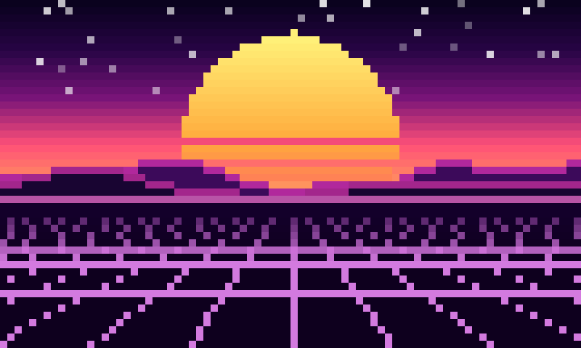

- 🎨 **24-bit color** with an automatic 256-color fallback
- 🖥️ **Fits any terminal size** and adapts when you resize the window
- ⌨️ **Any key exits** and **space pauses**. Your terminal is restored as it was.
- 🔀 **Shuffle mode** switches to a new random screensaver at a set interval
- 📦 **No extra dependencies**: just `bash` and `python3`

---

## 🎬 Gallery

| | | |
|:---:|:---:|:---:|
| 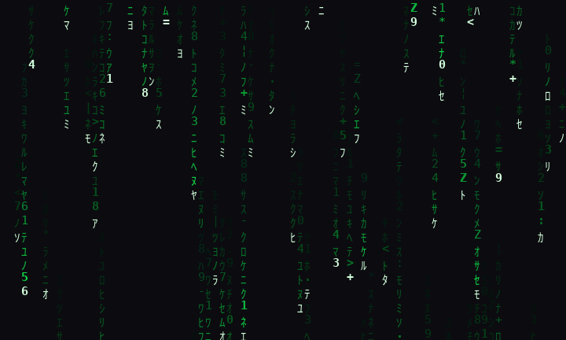 **Matrix**<br>Katakana digital rain with depth | 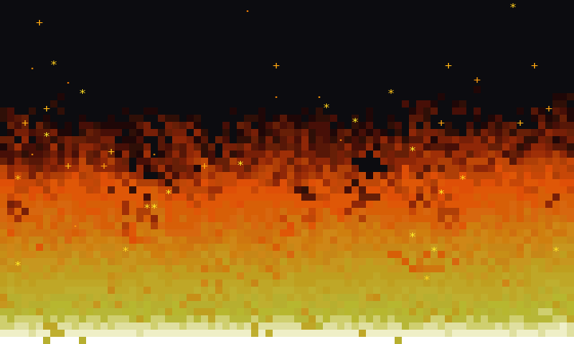 **Fire**<br>Doom-style fire with embers | 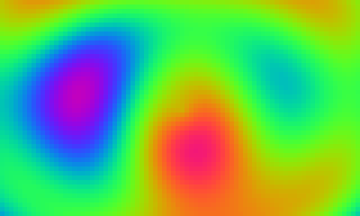 **Plasma**<br>Demoscene plasma with shifting palettes |
| 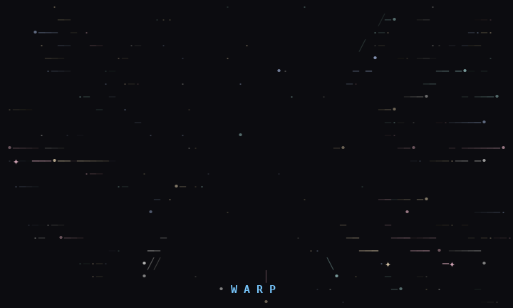 **Starfield**<br>Space flight with jumps to warp | 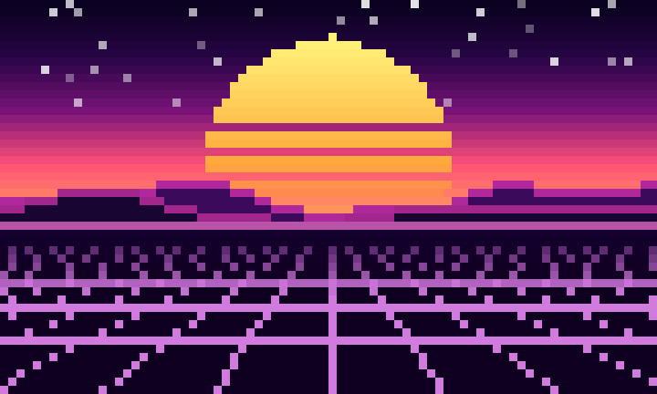 **Synthwave**<br>Outrun sunset and neon grid | 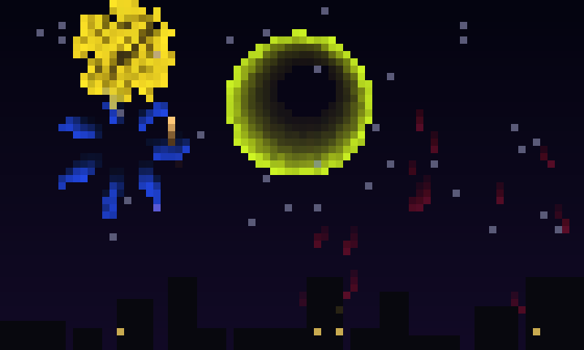 **Fireworks**<br>Bursts over a city skyline |
| 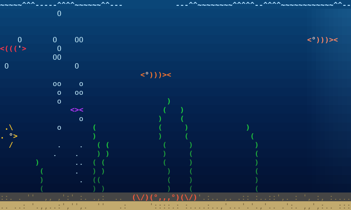 **Aquarium**<br>Fish, a crab, kelp and bubbles | 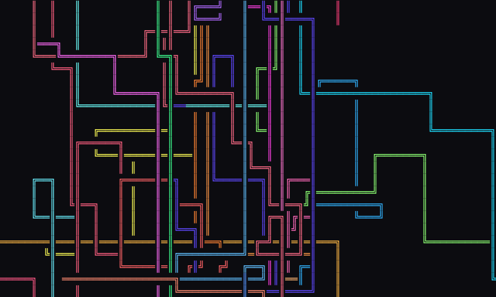 **Pipes**<br>The classic, in four line styles | 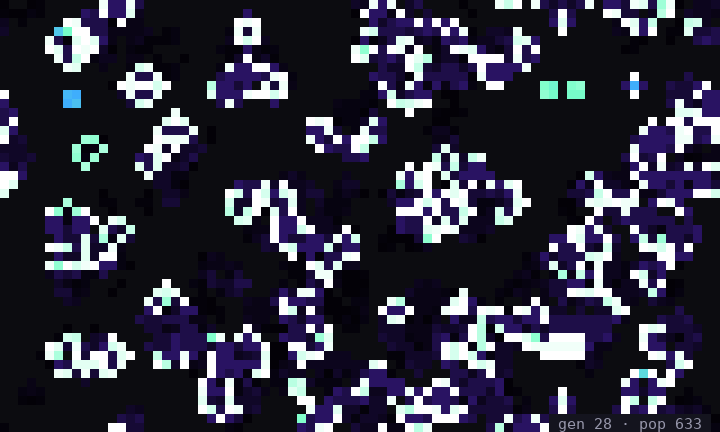 **Life**<br>Game of Life, colored by age |
| 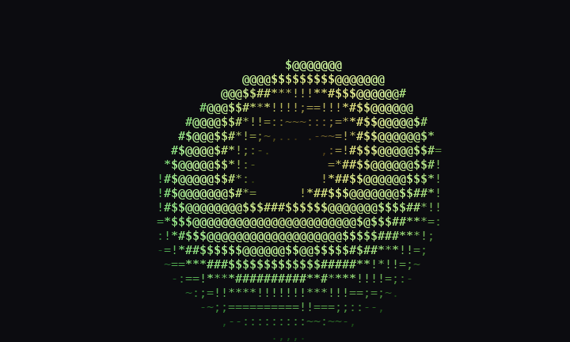 **Donut**<br>The famous spinning donut, in color | 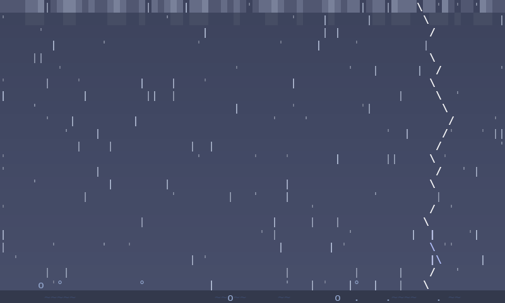 **Storm**<br>Rain, wind and forked lightning | 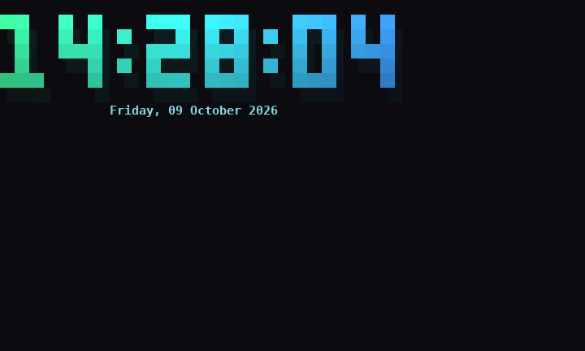 **Clock**<br>A giant clock bouncing like the DVD logo |

---

## 🚀 Install

### Debian / Ubuntu (recommended)

Download the latest `.deb` from [Releases](https://github.com/IsuruGunarathne/CLISS/releases/latest) and install it:

```bash
curl -LO https://github.com/IsuruGunarathne/CLISS/releases/latest/download/cliss.deb
sudo apt install ./cliss.deb
```

`apt` installs `python3` automatically if it's missing. To install a specific version, replace `latest/download` with `download/<tag>`, for example `download/v1/cliss.deb`.

### Any Linux distro (from source)

```bash
git clone https://github.com/IsuruGunarathne/CLISS.git
cd CLISS
./cliss                                        # run it straight from the folder
sudo ln -s "$PWD/cliss" /usr/local/bin/cliss   # optional: put it on your PATH
```

You need `bash` and Python 3.6 or newer.

### Build the .deb yourself

```bash
./package.sh                       # creates CLISS_PACKAGE.deb
sudo apt install ./CLISS_PACKAGE.deb
```

Or run `./clean_install.sh` to build and install in one step.

---

## 🎮 Usage

```bash
cliss                 # pick from the menu
cliss fire            # run one directly (names are case-insensitive)
cliss random          # surprise me
cliss shuffle 30      # a new random screensaver every 30 seconds (default 60)
cliss list            # list what's installed
cliss --help
```

While a screensaver is running, **any key exits** and **space pauses**.

### Colors

CLISS uses 24-bit color when your terminal advertises it (`COLORTERM=truecolor`, which most modern terminals set) and 256 colors otherwise. You can force a mode:

```bash
CLISS_COLOR=256 cliss plasma
CLISS_COLOR=truecolor cliss plasma
```

---

## ❌ Uninstall

```bash
sudo apt remove cliss
```

If you installed from source, delete the folder and the symlink (`sudo rm /usr/local/bin/cliss`).

---

## 🧩 Write Your Own Screensaver

Drop a `.py` (or `.sh`) file into `Animations/`. The launcher picks it up automatically, and `package.sh` bundles it. Add a `# cliss: <description>` line near the top to give it a menu description.

Python screensavers can use the small shared engine in [`Animations/lib/clissfx.py`](Animations/lib/clissfx.py). It handles the alternate screen, keys, resizing, colors and flicker-free diffed output:

```python
#!/usr/bin/env python3
# cliss: A bouncing ball
import os, sys
sys.path.insert(0, os.path.join(os.path.dirname(os.path.realpath(__file__)), "lib"))
from clissfx import run, hsv

class Ball:
    def __init__(self, scr):          # called again on every resize
        self.s, self.x, self.v = scr, 0.0, 20.0

    def frame(self, dt, t):           # dt = seconds since last frame
        s = self.s
        s.clear()
        self.x += self.v * dt
        if not 0 <= self.x < s.w:
            self.v = -self.v
            self.x = min(max(self.x, 0), s.w - 1)
        s.put(int(self.x), s.h // 2, "●", hsv(t * 0.1))

if __name__ == "__main__":
    run(Ball, fps=30)
```

Useful bits: `put(x, y, ch, fg, bg, bold)`, `text(...)`, and `blit_pixels(rows)`, which draws a grid of RGB "pixels" at twice the vertical resolution using half blocks.

---

## 🤝 Contributing

Pull requests are welcome, and new screensavers especially! Fork the repo, add your animation under `Animations/`, test it with `./cliss <name>`, and open a PR against `main`.

## 📦 Releases

Every pull request merged into `main` publishes a new release automatically: `v1`, `v1.1`, `v1.2`, and so on. Each release has a ready-to-install `cliss.deb`. See [`.github/workflows/release.yml`](.github/workflows/release.yml).

---

## 📁 Repository Structure

```
Animations/
  Matrix.py, Fire.py, Plasma.py, ...   the screensavers
  lib/clissfx.py                       shared terminal rendering engine
docs/screenshots/                      images used in this README
.github/workflows/release.yml          automatic releases on merge
cliss                                  the launcher
package.sh                             builds CLISS_PACKAGE.deb
clean_install.sh                       build + install in one step
```

---

## 📄 License

CLISS is released under the [MIT License](LICENSE).
